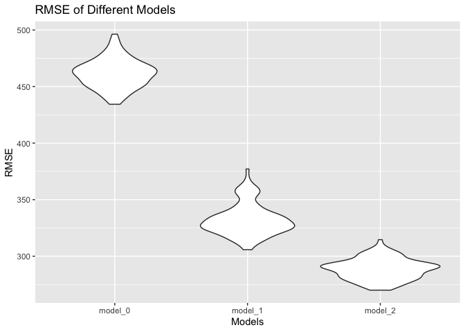

p8105_hw6_zz3039
================
2022-11-30

## Problem 2

### Homicide Data Import and Manipulation

``` r
homi_data = 
  read_csv("./data/homicide-data.csv") %>% 
  janitor::clean_names() %>% 
  mutate(
    city_state = paste(city, state, sep=", "),
    resolved = as.numeric(disposition == "Closed by arrest"),
    victim_age = as.numeric(victim_age),
    victim_sex = fct_relevel(victim_sex, "Female")) %>% 
  filter(city_state != "Dallas, TX",
         city_state != "Kansas City, MO",
         city_state != "Phoenix, AZ",
         city_state != "Tulsa, AL",
         victim_race == "White"|victim_race == "Black") %>% 
  select(city_state, everything(), - city, - state) %>% 
  drop_na()
```

    ## Rows: 52179 Columns: 12
    ## ── Column specification ────────────────────────────────────────────────────────
    ## Delimiter: ","
    ## chr (9): uid, victim_last, victim_first, victim_race, victim_age, victim_sex...
    ## dbl (3): reported_date, lat, lon
    ## 
    ## ℹ Use `spec()` to retrieve the full column specification for this data.
    ## ℹ Specify the column types or set `show_col_types = FALSE` to quiet this message.

    ## Warning in mask$eval_all_mutate(quo): NAs introduced by coercion

## Baltimore Data

``` r
bal_data = 
  homi_data %>% 
  filter(city_state == "Baltimore, MD")

fit_bal = 
  glm(resolved ~ victim_age + victim_sex + victim_race, data = bal_data, family = binomial) 

fit_bal %>% 
  broom::glance()
```

    ## # A tibble: 1 × 8
    ##   null.deviance df.null logLik   AIC   BIC deviance df.residual  nobs
    ##           <dbl>   <int>  <dbl> <dbl> <dbl>    <dbl>       <int> <int>
    ## 1         3568.    2752 -1746. 3501. 3524.    3493.        2749  2753

``` r
fit_bal_org = 
  fit_bal %>% 
    broom::tidy() %>% 
    mutate(OR = exp(estimate),
           conf.low = exp(estimate - 1.96*std.error),
           conf.high = exp(estimate + 1.96*std.error),
           CI = str_c("(", conf.low,", ", conf.high, ")")) %>% 
    select(term, OR, conf.low, conf.high, CI, everything())
```

The estimate and confidence interval of the adjusted odds ratio for
solving homicides comparing male victims to female victims keeping all
other variables fixed are: **0.4255117** and **(0.324558952282893,
0.557865468682637)**.

## Other cities’ Data

To obtain a logistic regression model with the OR and CI from the model,
I wrote a function to draw the estimated OR and CI from a logistic
model. Then, I first mapped logistic regression over each city, then
mapped the function over each logistic model for the desired values.

``` r
OR_and_CI = function(x) {
  
  extract_OR = 
    x %>% 
    broom::tidy() %>% 
    mutate(OR = exp(estimate),
           conf.low = exp(estimate - 1.96*std.error),
           conf.high = exp(estimate + 1.96*std.error),
           CI = str_c("(", conf.low,", ", conf.high, ")")) %>%
    select(OR, conf.low, conf.high, CI)
    
  
  extract_OR[3,]

}


all_city = 
  homi_data %>% 
  select(city_state, resolved, victim_age, victim_sex, victim_race) %>% 
  nest(variables = resolved:victim_race) %>% 
  mutate(
    homi_glm = map(variables, ~glm(resolved ~ victim_age + victim_sex + victim_race, family = binomial, data = .x))) %>% 
  select(city_state, homi_glm) %>% 
  mutate(variables = map(homi_glm, OR_and_CI)) %>% 
  select(- homi_glm) %>% 
  unnest(cols = variables) 
```

## Problem 3

``` r
bw_data = 
  read_csv("./data/birthweight.csv") %>% 
  janitor::clean_names()
```

    ## Rows: 4342 Columns: 20
    ## ── Column specification ────────────────────────────────────────────────────────
    ## Delimiter: ","
    ## dbl (20): babysex, bhead, blength, bwt, delwt, fincome, frace, gaweeks, malf...
    ## 
    ## ℹ Use `spec()` to retrieve the full column specification for this data.
    ## ℹ Specify the column types or set `show_col_types = FALSE` to quiet this message.

``` r
skimr::skim(bw_data)
```

|                                                  |         |
|:-------------------------------------------------|:--------|
| Name                                             | bw_data |
| Number of rows                                   | 4342    |
| Number of columns                                | 20      |
| \_\_\_\_\_\_\_\_\_\_\_\_\_\_\_\_\_\_\_\_\_\_\_   |         |
| Column type frequency:                           |         |
| numeric                                          | 20      |
| \_\_\_\_\_\_\_\_\_\_\_\_\_\_\_\_\_\_\_\_\_\_\_\_ |         |
| Group variables                                  | None    |

Data summary

**Variable type: numeric**

| skim_variable | n_missing | complete_rate |    mean |     sd |     p0 |     p25 |     p50 |     p75 |   p100 | hist  |
|:--------------|----------:|--------------:|--------:|-------:|-------:|--------:|--------:|--------:|-------:|:------|
| babysex       |         0 |             1 |    1.49 |   0.50 |   1.00 |    1.00 |    1.00 |    2.00 |    2.0 | ▇▁▁▁▇ |
| bhead         |         0 |             1 |   33.65 |   1.62 |  21.00 |   33.00 |   34.00 |   35.00 |   41.0 | ▁▁▆▇▁ |
| blength       |         0 |             1 |   49.75 |   2.72 |  20.00 |   48.00 |   50.00 |   51.00 |   63.0 | ▁▁▁▇▁ |
| bwt           |         0 |             1 | 3114.40 | 512.15 | 595.00 | 2807.00 | 3132.50 | 3459.00 | 4791.0 | ▁▁▇▇▁ |
| delwt         |         0 |             1 |  145.57 |  22.21 |  86.00 |  131.00 |  143.00 |  157.00 |  334.0 | ▅▇▁▁▁ |
| fincome       |         0 |             1 |   44.11 |  25.98 |   0.00 |   25.00 |   35.00 |   65.00 |   96.0 | ▃▇▅▂▃ |
| frace         |         0 |             1 |    1.66 |   0.85 |   1.00 |    1.00 |    2.00 |    2.00 |    8.0 | ▇▁▁▁▁ |
| gaweeks       |         0 |             1 |   39.43 |   3.15 |  17.70 |   38.30 |   39.90 |   41.10 |   51.3 | ▁▁▂▇▁ |
| malform       |         0 |             1 |    0.00 |   0.06 |   0.00 |    0.00 |    0.00 |    0.00 |    1.0 | ▇▁▁▁▁ |
| menarche      |         0 |             1 |   12.51 |   1.48 |   0.00 |   12.00 |   12.00 |   13.00 |   19.0 | ▁▁▂▇▁ |
| mheight       |         0 |             1 |   63.49 |   2.66 |  48.00 |   62.00 |   63.00 |   65.00 |   77.0 | ▁▁▇▂▁ |
| momage        |         0 |             1 |   20.30 |   3.88 |  12.00 |   18.00 |   20.00 |   22.00 |   44.0 | ▅▇▂▁▁ |
| mrace         |         0 |             1 |    1.63 |   0.77 |   1.00 |    1.00 |    2.00 |    2.00 |    4.0 | ▇▇▁▁▁ |
| parity        |         0 |             1 |    0.00 |   0.10 |   0.00 |    0.00 |    0.00 |    0.00 |    6.0 | ▇▁▁▁▁ |
| pnumlbw       |         0 |             1 |    0.00 |   0.00 |   0.00 |    0.00 |    0.00 |    0.00 |    0.0 | ▁▁▇▁▁ |
| pnumsga       |         0 |             1 |    0.00 |   0.00 |   0.00 |    0.00 |    0.00 |    0.00 |    0.0 | ▁▁▇▁▁ |
| ppbmi         |         0 |             1 |   21.57 |   3.18 |  13.07 |   19.53 |   21.03 |   22.91 |   46.1 | ▃▇▁▁▁ |
| ppwt          |         0 |             1 |  123.49 |  20.16 |  70.00 |  110.00 |  120.00 |  134.00 |  287.0 | ▅▇▁▁▁ |
| smoken        |         0 |             1 |    4.15 |   7.41 |   0.00 |    0.00 |    0.00 |    5.00 |   60.0 | ▇▁▁▁▁ |
| wtgain        |         0 |             1 |   22.08 |  10.94 | -46.00 |   15.00 |   22.00 |   28.00 |   89.0 | ▁▁▇▁▁ |

``` r
bw_data = 
  bw_data %>% 
  mutate(
    babysex = as.factor(babysex),
    frace = as.factor(frace),
    malform = as.factor(malform),
    mrace = as.factor(mrace))

skimr::skim(bw_data)
```

|                                                  |         |
|:-------------------------------------------------|:--------|
| Name                                             | bw_data |
| Number of rows                                   | 4342    |
| Number of columns                                | 20      |
| \_\_\_\_\_\_\_\_\_\_\_\_\_\_\_\_\_\_\_\_\_\_\_   |         |
| Column type frequency:                           |         |
| factor                                           | 4       |
| numeric                                          | 16      |
| \_\_\_\_\_\_\_\_\_\_\_\_\_\_\_\_\_\_\_\_\_\_\_\_ |         |
| Group variables                                  | None    |

Data summary

**Variable type: factor**

| skim_variable | n_missing | complete_rate | ordered | n_unique | top_counts                      |
|:--------------|----------:|--------------:|:--------|---------:|:--------------------------------|
| babysex       |         0 |             1 | FALSE   |        2 | 1: 2230, 2: 2112                |
| frace         |         0 |             1 | FALSE   |        5 | 1: 2123, 2: 1911, 4: 248, 3: 46 |
| malform       |         0 |             1 | FALSE   |        2 | 0: 4327, 1: 15                  |
| mrace         |         0 |             1 | FALSE   |        4 | 1: 2147, 2: 1909, 4: 243, 3: 43 |

**Variable type: numeric**

| skim_variable | n_missing | complete_rate |    mean |     sd |     p0 |     p25 |     p50 |     p75 |   p100 | hist  |
|:--------------|----------:|--------------:|--------:|-------:|-------:|--------:|--------:|--------:|-------:|:------|
| bhead         |         0 |             1 |   33.65 |   1.62 |  21.00 |   33.00 |   34.00 |   35.00 |   41.0 | ▁▁▆▇▁ |
| blength       |         0 |             1 |   49.75 |   2.72 |  20.00 |   48.00 |   50.00 |   51.00 |   63.0 | ▁▁▁▇▁ |
| bwt           |         0 |             1 | 3114.40 | 512.15 | 595.00 | 2807.00 | 3132.50 | 3459.00 | 4791.0 | ▁▁▇▇▁ |
| delwt         |         0 |             1 |  145.57 |  22.21 |  86.00 |  131.00 |  143.00 |  157.00 |  334.0 | ▅▇▁▁▁ |
| fincome       |         0 |             1 |   44.11 |  25.98 |   0.00 |   25.00 |   35.00 |   65.00 |   96.0 | ▃▇▅▂▃ |
| gaweeks       |         0 |             1 |   39.43 |   3.15 |  17.70 |   38.30 |   39.90 |   41.10 |   51.3 | ▁▁▂▇▁ |
| menarche      |         0 |             1 |   12.51 |   1.48 |   0.00 |   12.00 |   12.00 |   13.00 |   19.0 | ▁▁▂▇▁ |
| mheight       |         0 |             1 |   63.49 |   2.66 |  48.00 |   62.00 |   63.00 |   65.00 |   77.0 | ▁▁▇▂▁ |
| momage        |         0 |             1 |   20.30 |   3.88 |  12.00 |   18.00 |   20.00 |   22.00 |   44.0 | ▅▇▂▁▁ |
| parity        |         0 |             1 |    0.00 |   0.10 |   0.00 |    0.00 |    0.00 |    0.00 |    6.0 | ▇▁▁▁▁ |
| pnumlbw       |         0 |             1 |    0.00 |   0.00 |   0.00 |    0.00 |    0.00 |    0.00 |    0.0 | ▁▁▇▁▁ |
| pnumsga       |         0 |             1 |    0.00 |   0.00 |   0.00 |    0.00 |    0.00 |    0.00 |    0.0 | ▁▁▇▁▁ |
| ppbmi         |         0 |             1 |   21.57 |   3.18 |  13.07 |   19.53 |   21.03 |   22.91 |   46.1 | ▃▇▁▁▁ |
| ppwt          |         0 |             1 |  123.49 |  20.16 |  70.00 |  110.00 |  120.00 |  134.00 |  287.0 | ▅▇▁▁▁ |
| smoken        |         0 |             1 |    4.15 |   7.41 |   0.00 |    0.00 |    0.00 |    5.00 |   60.0 | ▇▁▁▁▁ |
| wtgain        |         0 |             1 |   22.08 |  10.94 | -46.00 |   15.00 |   22.00 |   28.00 |   89.0 | ▁▁▇▁▁ |

### Model fitting

As there have long held the belief in China that women should eat more
during pregnancy, I decided to build a regression model to explore the
influence of mothers’ weight gain, mothers’ weight before pregant and
bmi before pregant on the children’s birth weight.

``` r
bw_data = 
  bw_data %>% 
  mutate(
    mrace = recode_factor(mrace, "1" = "White","2" = "Black", "3" = "Asian", "4" = "Puerto Rican", "8" = "Other")) 

bw_lm = lm(bwt ~ wtgain + ppwt + ppbmi, data = bw_data)
summary(bw_lm)
```

    ## 
    ## Call:
    ## lm(formula = bwt ~ wtgain + ppwt + ppbmi, data = bw_data)
    ## 
    ## Residuals:
    ##      Min       1Q   Median       3Q      Max 
    ## -2416.89  -278.65    23.55   312.45  1581.37 
    ## 
    ## Coefficients:
    ##              Estimate Std. Error t value Pr(>|t|)    
    ## (Intercept) 2366.1786    54.3577  43.530  < 2e-16 ***
    ## wtgain        11.8791     0.6743  17.616  < 2e-16 ***
    ## ppwt           9.1517     0.6978  13.114  < 2e-16 ***
    ## ppbmi        -29.8667     4.4359  -6.733 1.88e-11 ***
    ## ---
    ## Signif. codes:  0 '***' 0.001 '**' 0.01 '*' 0.05 '.' 0.1 ' ' 1
    ## 
    ## Residual standard error: 483 on 4338 degrees of freedom
    ## Multiple R-squared:  0.1112, Adjusted R-squared:  0.1106 
    ## F-statistic:   181 on 3 and 4338 DF,  p-value: < 2.2e-16

``` r
bw_lm %>% 
  plot(which = 2)
```

<!-- -->

``` r
bw_data %>% 
  modelr::add_residuals(bw_lm) %>% 
  modelr::add_predictions(bw_lm) %>% 
  ggplot(aes(x = pred, y = resid)) + geom_violin() +
  labs(
    title = "Residual vs Prediction in Linear Model",
    x = "Prediction Value",
    y = "Model Residual"
  )
```

<!-- -->

The result showed that all three factors were significant in determining
children’s birth weigth. The Q-Q plot and violin plot showed that the
residuals of the model roughly followed normal distribution.

### Model modifying

After confirming that all three factors’ significance, I decided to
explore if the three factors affect children’s birth weight differently
within different races of mothers.

``` r
bw_lm_nested = lm(bwt ~ wtgain*mrace + ppwt*mrace + ppbmi*mrace, data = bw_data)
summary(bw_lm_nested)
```

    ## 
    ## Call:
    ## lm(formula = bwt ~ wtgain * mrace + ppwt * mrace + ppbmi * mrace, 
    ##     data = bw_data)
    ## 
    ## Residuals:
    ##      Min       1Q   Median       3Q      Max 
    ## -2256.13  -253.22    20.72   305.79  1481.06 
    ## 
    ## Coefficients:
    ##                           Estimate Std. Error t value Pr(>|t|)    
    ## (Intercept)              2531.2390    78.4831  32.252  < 2e-16 ***
    ## wtgain                      9.5327     0.9752   9.775  < 2e-16 ***
    ## mraceBlack               -431.8784   107.0124  -4.036 5.54e-05 ***
    ## mraceAsian                110.0181   850.8382   0.129 0.897122    
    ## mracePuerto Rican        -653.5126   263.5681  -2.479 0.013195 *  
    ## ppwt                        9.8782     0.9708  10.175  < 2e-16 ***
    ## ppbmi                     -32.8168     6.2160  -5.279 1.36e-07 ***
    ## wtgain:mraceBlack           4.6316     1.3312   3.479 0.000508 ***
    ## wtgain:mraceAsian          -7.1813    13.2803  -0.541 0.588706    
    ## wtgain:mracePuerto Rican    1.8311     2.7680   0.662 0.508309    
    ## mraceBlack:ppwt            -3.7466     1.3993  -2.678 0.007444 ** 
    ## mraceAsian:ppwt           -10.0728    10.1309  -0.994 0.320150    
    ## mracePuerto Rican:ppwt      0.1214     3.3880   0.036 0.971424    
    ## mraceBlack:ppbmi           22.5810     8.8722   2.545 0.010958 *  
    ## mraceAsian:ppbmi           57.8968    63.3561   0.914 0.360856    
    ## mracePuerto Rican:ppbmi    22.8011    21.4929   1.061 0.288811    
    ## ---
    ## Signif. codes:  0 '***' 0.001 '**' 0.01 '*' 0.05 '.' 0.1 ' ' 1
    ## 
    ## Residual standard error: 459 on 4326 degrees of freedom
    ## Multiple R-squared:  0.1995, Adjusted R-squared:  0.1967 
    ## F-statistic: 71.88 on 15 and 4326 DF,  p-value: < 2.2e-16

``` r
bw_lm_nested %>% 
  plot(which = 2)
```

<!-- -->

``` r
bw_data %>% 
  modelr::add_residuals(bw_lm_nested) %>% 
  modelr::add_predictions(bw_lm_nested) %>% 
  ggplot(aes(x = pred, y = resid)) + geom_violin() + facet_grid(~mrace) +
  labs(
    title = "Residual vs Prediction in Nested Model",
    x = "Prediction Value",
    y = "Model Residual"
  )
```

<!-- -->

The result showed that the three factors have different influences on
birth weight of children with different races of mothers. They were all
most influential on children with Black mothers, no significant
influence were showed on children with Asian mothers.

## Model Comparison

``` r
model_1 = lm(bwt ~ blength + gaweeks, data = bw_data)
model_2 = lm(bwt ~ (bhead + blength + babysex)^3, data = bw_data)
```

``` r
cv_bw = 
  crossv_mc(bw_data, 100) %>% 
  mutate(
    train = map(train, as_tibble),
    test = map(test, as_tibble)) %>% 
  mutate(
    model_0  = map(train, ~lm(bwt ~ wtgain*mrace + ppwt*mrace + ppbmi*mrace, data = .x)),
    model_1  = map(train, ~lm(bwt ~ blength + gaweeks, data = .x)),
    model_2  = map(train, ~lm(bwt ~ (bhead + blength + babysex)^3, data = .x))) %>% 
  mutate(
    rmse_model_0 = map2_dbl(model_0, test, ~rmse(model = .x, data = .y)),
    rmse_model_1 = map2_dbl(model_1, test, ~rmse(model = .x, data = .y)),
    rmse_model_2 = map2_dbl(model_2, test, ~rmse(model = .x, data = .y)))

cv_bw %>% 
  select(starts_with("rmse")) %>% 
  pivot_longer(
    everything(),
    names_to = "model", 
    values_to = "rmse",
    names_prefix = "rmse_") %>% 
  mutate(model = fct_inorder(model)) %>% 
  ggplot(aes(x = model, y = rmse)) + geom_violin() +
  labs(
    title = "RMSE of Different Models",
    x = "Models",
    y = "RMSE"
  )
```

<!-- -->

The violin plot indicated that the prediction error of the last two
models were smaller than the model I fitted. Which was a sad news I had
to accept.
